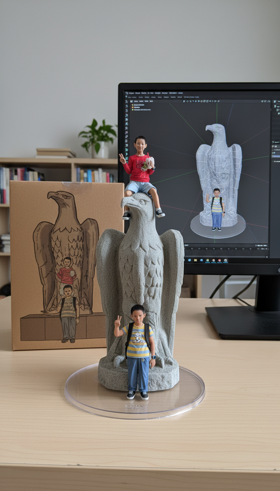
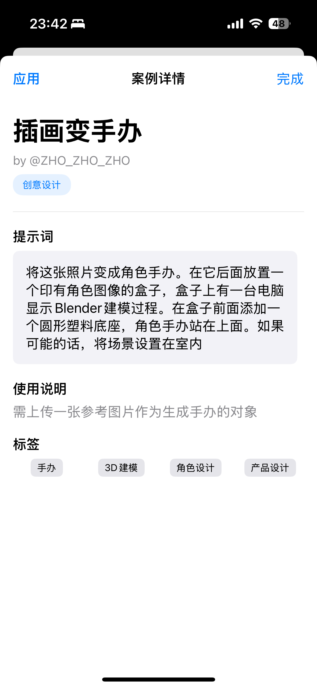

# Nano Banana iOS App

一个使用 Gemini 2.5 Flash Image Preview 模型的 AI 图像生成应用。

https://github.com/buld-your-own-x-with-ai/Nano-Banana

## 应用截图

| 应用主界面 | Nano Banana 生成效果 | 提示词界面 | 原始图像处理 |
|:---:|:---:|:---:|:---:|
|  |  |  |  |


## 功能特性

### 🎨 图像生成
- **文本到图像**：根据文字描述生成高质量图片
- **图像编辑**：上传图片并使用文本提示进行编辑
- **多轮对话**：通过对话方式逐步优化图片
- **高保真文本渲染**：生成包含清晰文本的图片

### 📚 精选案例
- **68个实用案例**：涵盖创意设计、人物编辑、风格转换等
- **分类浏览**：按功能分类，便于查找
- **搜索功能**：快速找到相关案例
- **一键应用**：点击"应用"按钮直接将案例提示词应用到生成页面

### 🚀 高级功能
- **批量生成**：一次性生成多张图像，提高工作效率
- **迭代编辑**：多轮对话式图像优化，逐步完善效果
- **智能缓存**：自动缓存生成结果，节省API调用
- **速率限制**：内置请求频率控制，避免API限制

### ⚙️ 设置管理
- **API 密钥管理**：安全存储和管理 Gemini API 密钥
- **缓存管理**：查看和清理图像缓存
- **使用教程**：详细的设置和使用指南

## 新增功能：一键应用案例

### 使用方法
1. 在"案例"页面浏览精选案例
2. 点击感兴趣的案例查看详情
3. 在案例详情页面点击左上角的"应用"按钮
4. 应用会自动切换到"生成"页面并填入提示词
5. 直接点击"生成图像"开始创作

### 功能优势
- **无需手动输入**：避免复制粘贴的繁琐操作
- **快速体验**：一键即可体验专业级提示词效果
- **学习参考**：通过实际案例学习如何编写有效的提示词

## 案例分类

### 🎨 创意设计
- 徽标设计、海报制作、艺术创作等

### 👤 人物编辑
- 人像美化、表情修改、服装替换等

### 🎭 风格转换
- 艺术风格迁移、色彩调整、氛围营造等

### 📦 产品设计
- 产品渲染、包装设计、展示效果等

### 🔧 技术应用
- 图表生成、技术插图、示意图制作等

## 开始使用

1. **设置 API 密钥**
   - 获取 Gemini API 密钥
   - 在设置页面输入密钥

2. **浏览案例**
   - 查看精选案例库
   - 学习优秀的提示词写法

3. **生成图像**
   - 输入描述或应用案例提示词
   - 可选择上传参考图像
   - 点击生成开始创作

## API 最佳实践

### 🔒 安全设置
应用内置了完整的内容安全过滤机制：
```swift
// 自动应用的安全设置
safetySettings: [
    "HARM_CATEGORY_HATE_SPEECH": "BLOCK_MEDIUM_AND_ABOVE",
    "HARM_CATEGORY_DANGEROUS_CONTENT": "BLOCK_MEDIUM_AND_ABOVE",
    "HARM_CATEGORY_HARASSMENT": "BLOCK_MEDIUM_AND_ABOVE",
    "HARM_CATEGORY_SEXUALLY_EXPLICIT": "BLOCK_MEDIUM_AND_ABOVE"
]
```

### ⚡ 性能优化
- **智能缓存**：重复请求自动从缓存返回
- **速率限制**：内置1秒最小请求间隔
- **输入验证**：提示词长度限制2000字符
- **图像压缩**：自动压缩到4MB以内

### 🔄 批量处理
```swift
// 批量生成示例
let prompts = [
    "未来风格的纳米香蕉实验室场景",
    "香蕉皮纹理的科技产品设计",
    "微观世界中的香蕉分子结构"
]
await viewModel.batchGenerateImages(prompts: prompts)
```

### 🎯 迭代编辑
```swift
// 多轮编辑示例
await viewModel.iterativeImageEditing(
    initialPrompt: "一个简单的香蕉图像",
    editPrompts: [
        "将背景改为实验室场景",
        "添加纳米尺寸效果",
        "增强科技感和未来感"
    ]
)
```

## 技术特性

- **SwiftUI 界面**：现代化的用户界面设计
- **MVVM 架构**：清晰的代码结构和状态管理
- **异步处理**：流畅的用户体验，支持并发操作
- **本地存储**：安全的 API 密钥和图像缓存管理
- **图像处理**：完整的图像显示、编辑和保存功能
- **错误处理**：详细的错误分类和用户友好的提示
- **网络优化**：智能重试机制和网络状态检测

## 系统要求

- iOS 18.5+
- Xcode 16+
- 有效的 Gemini API 密钥

---

享受 AI 图像生成的乐趣！🎉